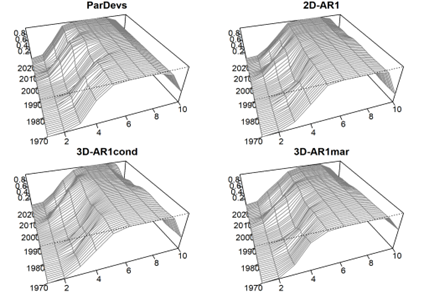
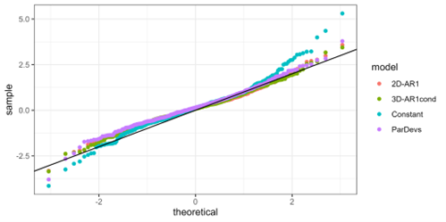

# Executive Summary

Fishery age composition residuals have suggested misfit for this model for several decades, and has been a point of concern for the PT and SSC. More flexible configurations for fishery selectivity need to be explored.  Facilitation of a new suite of more flexible non-parametric and semi-parametric selectivities in a more rigorous statistical framework requires moving away from ADMB and toward its replacement TMB. We thus ported model 19.1a (the 2022 final model) to TMB and demonstrate nearly identical estimates. We call the TMB version of 19.1a model 23.0 to reflect the change in software framework. We then used model 23.0 to explore a suite of fisheries selectivities which vary in their flexibility and where that flexibility is permitted. We conclude that two non-parametric models would make for an improved fisheries selectivity formulation based on analyzing OSA residuals, AIC model selection, and performance in projected selectivity. The models are 23.0a which uses a 2D AR(1) model, and 23.0b which uses a so-called 3D AR(1) process that parses age, year, and cohort correlations from the data. These models are not expected to greatly impact management advice, but we believe their improved performance and projection capabilities make for a better stock assessment moving forward.

**The authors recommend moving to 23.0 this year, and leave it up to PT discretion whether to adopt 23.0a or 23.0b this year.**


# Proposed models

## Model 23.0: Bridging from ADMB to Template Model Builder

Template Model Builder [TMB; @Kristensen2015] is a software platform designed to estimate complex, non-linear hierarchical models. Its primary feature is the ability to efficiently apply the Laplace approximation to the marginal likelihood, so that process errors can be estimated using standard numerical optimization [@Skaug2006]. It is widely seen as the successor to ADMB, which has limited Laplace approximation capabilities and thus a penalized maximum likelihood approach is generally taken (i.e., process errors fixed and random effects estimated as fixed effects). Despite this important advantage, there have been relatively few implementations for stock assessments in the North Pacific. TMB is used more widely in other areas, such as WHAM [@Stock2021] on the US East Coast, and SAM [@Nielsen2014] in Europe. A WHAM version of the GOA pollock assessment was presented to the Plan Team in 2022, but there are advantages to using a bespoke model like the ADMB version developed by Martin Dorn and used for decades. Here we present a direct port of the 2022 accepted ADMB model 19.1a to TMB. Due to a change in software we name this model 23.0, although our initial goal is to match model 19.1a as close as possible. 

We therefore converted the bespoke ADMB model to TMB. There are a few important differences between ADMB and TMB in terms of syntax and functionality relevant to stock assessments. TMB has no native phased estimation capabilities (although there is an R function that serves a similar purpose) so all parameters are estimated simultaneously starting from their initial values. We used the 19.1a MLE estimates as initial values in model 23 and were able to obtain the same model predictions, and when optimized from there the same standard errors (uncertainties) for parameters and derived quantities (Fig 1.). TMB does not have an equivalent to ADMB’s “dev_vector” parameter class which penalizes a vector to have a mean of zero. Model 19.1a uses this feature by estimating a single mean in addition to the vector. When converting to a standard unpenalized vector, a degree of freedom is lost. The means are thus fixed at arbitrary values and mathematically the two become equivalent. 


## Non-parametric and semi-parametric fisheries selectivity

This stock has had persistent residual patterns in the fishery age composition data for many years, particularly for age 4 and 5 (Fig. 2). This has been a concern of the PT for many years. For instance

*The GOA Plan Team in its November 2019 minutes recommended the author examine fishery selectivity, as persistent patterns in the catch-at-age residuals may represent artifacts of the selectivity functional form used.*

{#fig:figure2}
In 2022 several ad hoc approaches were explored which demonstrated that a more flexible fisheries selectivity form could reduce the residual patterns. However, these approaches were difficult to justify and relied on arbitrarily setting likelihood penalties of time-varying selectivity curves. Instead it would be ideal to explore more flexible selectivity options based on published literature, and estimate the amount of flexibility from the data. We therefore use model 23.0 to explore alternative selectivity parameterizations. First, we review three important classes of hierarchical modeling approaches that can be used for selectivity: parametric, non-parametric, and semi-parametric functions.

### Parametric models

Parametric selectivity curves are mathematical functions that have typically 2-4 parameters that define a specific form or shape (often asymptotic or dome shaped). Some common functions selected for parametric selectivity are: double normal, logistic, and double logistic. The pollock model has used double logistic historically. They are usually selected based on hypothesized interactions between fishing/survey gear and the stock. That interaction accounts for “availability (i.e., the probability that a fish of a specific age or size is in the same vicinity at the same time as gear deployment) and contact (or gear) selectivity (i.e., the relative probability that a fish of specific age or size is caught given it is available to the gear” [@Privitera-Johnson2022].

A common way to incorporate time variation in parametric models is to let the parameters vary over time, penalized as a random walk or AR(1) process. This is the current situation for model 19.1a, and historical models, where the ascending inflection point and slope parameters are time-varying. Arbitrary penalties are used in a penalized maximum likelihood context. With TMB, the variances are now estimable. 

### Non-parametric models

Non-parametric selectivity functions are functions that estimate parameters for each age or age by year to flexibly estimate the shape based on available data. Non-parametric models penalize large fluctuations between ages and/or years because it is unlikely that the availability or contact selectivity has large shifts between ages and/or years. For example, the Woods Hole Assessment Model (WHAM) can estimate age-specific parameters with additional yearly variation penalized by a year and age 2D-AR1 function [@Stock2021]. Similarly, the stock assessment model (SAM) can estimate year and age specific selectivity that follows a random walk with multivariate normal increments that can include multiple correlation parameterizations [@Nielsen2014]. 

Recently @Cheng2023 introduced a computationally efficient form of the 2D AR(1) process that parses variation by age, year and cohort. They provide a “marginal variance” and “conditional variance” version of this approach, which differ in how the covariance matrix is calculated. A priori the marginal variance option seems a better fit, but both are explored. The main potential advantage of this “3D” approach over the 2D one is that if there is cohort targeting by the fishery then this signal could be detected and propagated into projected selectivity, thus improving near-term estimates of SPR and management reference points.

In our non-parametric models, we estimate a mean selectivity at each age (ages 1-10), with deviations around those means allowing for flexibility. These deviations can be configured to correlate by age, year, or age and year (2D), or age, year and cohort (3D). The variances and correlations associated with these AR(1) models are estimable by TMB simultaneously with the rest of the assessment, hence uncertainty is appropriately propagated through the model.

### Semi-parametric models

Semi-parametric selectivity functions are an intermediate between non-parametric and parametric models. The key difference is that a constant parametric form is estimated, and then the predicted selectivity at each age is scaled based on an exponentiated random effect deviation. @Xu2019 develop a semi-parametric curve that combines the parametric logistic function with 2D-AR1 age and year specific nonparametric deviations. We extend this approach for the double logistic used for pollock. The configuration and estimation of the non-parametric component is the same.


## Model set explored 

Since model 23 is in TMB it is now possible to explore a large suite of new flexible selectivity forms. We wanted to explore how internally estimating time-varying fisheries selectivity would behave and compare to model 19.1a generally, so we selected a fairly large set of models (Table 1). 

```{r, echo=FALSE, results = 'asis', message=FALSE}
library(knitr)
library(kableExtra)
library(dplyr)
table1 <- read.csv("Results/Table1_model_description.csv")
colnames(table1) <- c("Model", "Type",	"Fixed (k) and random (p) effects associated with fisheries selectivity"
)
kable1 <- table1 %>%
  kable(caption = "**Table 1.** Fisheries selectivity models considered and fit.") %>%
  kable_classic(full_width = F, html_font = "Cambria")
kable1
```

The selectivity equation details are given below.

* Mod 0: Parametric double logistic
    + $Sel_{age}= f_1 (age)$
    + $f_1 (age) = 1/(1+exp(-slp_1*(age-inf_1))*(1-1/(1+exp(-slp_2*(age-inf_2)))$
    
* Mod 1: Parametric double logistic w/ random effects on ascending parameters
    + $Sel_{(age,y)} = f_1(age)$ as above but:
    + $slp_{1,y}=slpdev_{1,y}$
    + $inf_{1,y}=inf_dev_{1,y}$
    + $slpdev_y-slpdev_{y-1} \sim N(0,\sigma )$
    + $infdev_y-infdev_{y-1} \sim N(0,4*\sigma )$
    
* Mod 2: Semi-parametric double logistic * AR(1) by age
    + $Sel_{age} = f_1(age)*exp(dev_{age})$
    + $dev_{age} \sim MVN(0,\Sigma_a)$
    
* Mod 3: Semi-parametric double logistic * AR(1) by year
    + $Sel_{age,y}= f_1 (age)*exp⁡(dev_y)$
    + $dev_y \sim MVN(0,\Sigma _y)$
    
* Mod 4: Semi-parametric double logistic * 2D-AR(1) by age, year
    + $Sel_{age,y}= f_1 (age)*exp⁡(dve_{age,y}))$
    + $dev_{age,y} \sim MVN(0,\Sigma _{age,y}) $
	
* Mod 5: Non-parametric by age
    + $Sel_{age}=f_2 (age)$
    + $f_2 (age) = 1/(1+exp(-(par_{age}))$
	
* Mod 6: Non-parametric AR(1) by year
    + $Sel_{age,y}=1/(1+exp(-(selpar_{age}+dev_y))$
    + $dev_y \sim MVN(0,\Sigma _y) $
	
* Mod 7: Non-parametric 2D AR(1) age, year
    + $Sel_{age,y}=1/(1+exp(-(selpar_{age}+dev_{age,y}))$
    + $dev_{age,y} \sim MVN(0,\Sigma _{age,y}) $
	
* Mod 8: 3D AR(1) by a, y, and cohort using conditional variance 
    + $Sel_{age,y}=1/(1+exp(-(selpar_{age}+dev_{age,y}))$
    + $dev_{age,y} \sim MVN(0,\Sigma _{age,cohort,y}) $
	
* Mod 9: 3D AR(1) by a, y, and cohort using marginal variance
    + $Sel_{age,y}=1/(1+exp(-(selpar_{age}+dev_{age,y}))$
    + $dev_{age,y} \sim MVN(0,\Sigma _{age,cohort,y})$
    
where $selpar_{age}$ are age-specific parameters for the non-parametric selectivity curve, $dev_{age,y}$ are the random deviates for the non-parametric selectivity that are multivariate normal with covariance $\Sigma$. 


## Selecting and validating flexible selectivity forms

Below we fit the alternative selectivity options (Table 1) to explore model behavior and help understand the level of complexity and flexibility needed to appropriately model fisheries selectivity. We use three primary tools to compare and contrast these models. First, we use one-step-ahead (OSA) residuals which are an improved tool over the ubiquitous Pearson residuals [@Trijoulet2023]. These residuals are expected to be standard normal under a correctly-specified model. We focus on visual inspection via bubble plots for non-random patterns by age, year, or cohort, as is common for Pearson residuals, instead of relying on statistical tests of normality or other properties. In particular for this example we focus on residuals for ages 3-5 which have been identified as problematic previously.

Second, we use marginal AIC for model selection. Model selection is not routinely used for stock assessment models because of the challenges associated with interpreting selection criteria when fitting to different types of data whose weights are often tuned and the use of penalized maximum likelihood [@Maunder2013;@Punt2014]. An added complication with the hierarchical models investigated here is that the penalty for the number of effective parameters does not include the random effects. Conditional AIC accounts for this but is not available at the moment. So, while the interpretation of differences in AIC is not as straightforward as in other statistical contexts, AIC still provides some important insight into the performance of the different models examined here.

Finally, we are interested in the ability of the model to estimate selectivity in the current year and near-term projections when no age data are available to inform selectivity. In previous models a 5-year average was used, but this ignores signals of annual and cohort trends in the data. We compare these approaches using retrospective predictions of age-specific selectivity and B40. Specifically, consecutive years of data were removed, the model was refit, and $SPR_{40%}$ was calculated using 1-year predicted and terminal selectivity. Predicted age-specific selectivity and $SPR_{40%}$ from a model fit until year $y-1$ was compared to terminal age-specific selectivity and $SPR_{40%}$ from a model fit until year $y$ using relative bias and mean squared error. Note that Francis weights were not updated for each retrospective peel.

# Results

## Model fits

Many models listed in Table 1 had poor performance (discussed more below) or do not have substantial flexibility to address the initial problem  (Table 2).  Additionally, model 9: 3D-AR1 with marginal variance did not converge. These models are ignored for clarity, and we focus on what we consider the most promising two new models: 2D-AR1 and 3D-AR1cond, and include ParDev (which is similar to accepted model 19.1a), and the Constant model as a baseline. Model 8: 3D-AR1 with conditional variance resulted in the lowest AIC followed by model 1: ParDevs (Table 2).

The estimated AR(1) parameters for the 2D-AR1 model are 0.869 (95% CI of 0.738-0.937) for the correlation by age and 0.628 (0.339-0.809) for the correlation by year, both positive and strongly statistically significant. The estimated process error was 0.259 (0.175-0.384). For the 3D-AR1 model the estimated **partial** correlations were 0.71 (0.566-0.868) for age, -0.076 (-0.597-0.455) for year, and 0.400 (-0.254-1.053) for cohort. Thus, the year correlation is not significant, the cohort one positive but not significant, and the age correlation highly significant. Finally, the estimated process error for the 3D-AR1 model was 0.277 (0.197-0.389) which was similar in magnitude and uncertainty as in the 2D model.

```{r, echo = FALSE, results = 'asis'}
table2 <- read.csv("Results/Table2_aic_and rp_comparison.csv")
colnames(table2) <- c("Model", "Total NLL", "Fsh NLL",	"K",	"dAIC",	"2023 SSB",	"B0",	"B40",	"2023 OFL",	"2023 ABC")
table2 %>%
  kable(caption = "**Table 2.** Comparison of selectivity models for the 2022 assessment model. Models selected for comparison are highlighted in grey. NLL=negative log likelihood, Fsh = fishery age composition; K=number of fixed effects; dAIC=delta AIC.") %>%
  kable_classic(full_width = F, html_font = "Cambria")
```


Spawning stock biomass (SSB) was relatively similar among the new TMB models, particularly in later years (Fig. 3) with a projected SSB of between 212 and 226 kt in 2023 (Table 2). However, the TMB models all had a higher 2023 SSB than 19.1a (Table 2) and lower uncertainty (Fig. 3). It is unclear why this is but is likely a configuration issue that can be resolved with more time. The TMB models differ in their calculation of ABC because rather than use the average fishery selectivity from the last five years of the assessment, they use predicted selectivity in 2023.  

{#fig:figure3}
The estimated annual selectivity at age also had the same general patterns, but with some important differences. All models estimated selectivity at ages 6-8 near 1 (Figs. 4 & 5). All models also estimated selectivity at age 2 to be near zero except for a period of about 2000-2010. For age 3, all models generally agreed and there appear to be meaningful annual changes, for example in 2008 selectivity was nearly 0.5, but dropped to around 0.2 by 2015. 

Key differences among models are concentrated in ages 4 and 5. As noted previously, these are the two ages with poor residuals for the ParDev approach. The largest differences were starting in 2000, with the two nonparametric models estimated lower age-4 selectivity (Fig. 5). Age 5 selectivity was always estimated over 0.75 but again there are some differences annually. Overall, all three models estimated distinct patterns of age 4 and 5 selectivity. This is somewhat surprising given the similarity of the 2D and 3D AR(1) approaches. Differences in estimates in projected years are also meaningful, but described separately below.

{#fig:figure4}

{#fig:figure5}

## Model selection and validation

OSA residuals for the Constant model show clear patterns and unexpectedly large OSA residuals (Fig. 6). This justifies more flexible selectivity forms. The ParDevs model shows much improvement, but still has lingering patterns in ages 4, 5, and 9, despite having a similar AIC value. The two non-parametric models eliminated the previous issues, and have no lingering age or year patterns. There does appear to be a lingering cohort pattern for the 2012 year class (diagonal positive residuals).

{#fig:figure6}

One important property of OSA residuals is that they are expected to have a standard normal distribution. Standard QQ plots (Fig. 7) show that the unexpectedly large residuals using the Constant model are eliminated by the three time-varying selectivity models. However, there still seem to be some distributional issues remaining, although we judge this to be of minor concern. We do note that the QQ plots for the two non-parametric models appear slightly better than the ParDevs approach currently used in 19.1a.  

{#fig:figure7}
## Projection performance

Fisheries selectivity for the current assessment year has no fisheries age composition data and so needs to be extrapolated by the assessment model. Further, reference point and ABC calculations rely on estimates of selectivity in the following year. These projected selectivities are expected to vary among models. The ParDevs model which has a random walk on parameters will have the same prediction as the last year with data, but increasing uncertainty with further extrapolation into the future (Fig. 8). The two AR(1) models will converge toward their stationary means, but the addition of the cohort effect for the 3D method will affect the estimates and transitory behavior toward the mean. For many ages there is little meaningful difference. The age with the most divergence among models is age 4, where selectivity is 0.91 for the ParDevs, 0.68 for the 2D-AR1 model, and 0.63 for the 3D-AR1 model. Interestingly the selectivity is increasing for the 2D model and decreasing for the 3D model for this age. We hypothesize this is caused by a cohort effect, although it is not strictly statistically significant.

![**Figure 8.** Behavior of the selectivity modules when projecting past the last year with fishery age comp data (2021; vertical line). Annual estimates of selectivity at age (panels) with uncertainty (ribbons, +/- 1 SE) for candidate models. Ages 1, 6,7 and 8 are left off for visual clarity as they are nearly constant at 0 or 1 (see Fig. 5). The ParDev model is a random walk so its projections are constant with increasing uncertainty. The 2D-AR1 model reverts back to its stationary mean. The 3D-AR1 model accounts for cohort effects and thus behaves slightly differently from the 2D version.](Results/Figure8_projected_sel.png){#fig:figure8}

There are thus important differences, especially in younger ages, for the predicted selectivity at the two important extrapolated years (Fig. 9).

{#fig:figure9}

# Conclusions

Moving from ADMB to TMB has a few minor disadvantages which are clearly outweighed by the advantage of being able to estimate hierarchical models in a statistically defensible way. Hierarchical or “state space” models are now considered “best practices” for stock assessment [@Punt2023] and TMB is the best available tool to accommodate that framework. We were able to bridge from the ADMB model 19.1a to within a very small degree of error. **As such we recommend retiring the ADMB model and proceeding with model 23 in TMB for use moving forward. ** This modeling framework will allow for important future extensions beyond fisheries selectivity as well (e.g., maturity and weight at age smoothing internally).

It is also clear that fisheries selectivity varies over time and that the current approach of random walk parameter deviations (ParDev model) is insufficiently flexible for some ages, as determined by residual patterns. The semi-parametric models explored here did not perform well, for reasons that are not completely clear at the moment. But two of the non-parametric models were very promising and had improved residual patterns. The 3D model had the lowest AIC, with the 2D model about 10 units worse. We believe both non-parametric models would make for improved fits and projected selectivities for use in calculating management quantities. The major disadvantage of the non-parametric models is that they are about 10 times slower to fit than the parametric version with annual deviates (ParDevs), going from 4 to 40 minutes to optimize and do the delta method calculations. 

Estimating non-parametric components within an assessment takes care, as putting flexibility in the wrong component can lead to poor management advice [@Szuwalski2018; @Fisch2023]. We feel confident that selectivity does vary through time, and that the forms examined here do a good job at capturing this change. The new forms also did not lead to major changes in status, trend, or reference points among different selectivity options, but there is a remaining discrepancy when compared to 19.1a that we need to investigate and resolve. Overall, we conclude that either non-parametric option would make for an improved model, with the 3D version fitting slightly better and having a cohort effect, but being more difficult to estimate. We therefore propose models 23.0a as 23 but with 2D AR(1) fisheries selectivity, and 23.0b with 3D AR(1) conditional variance. **We leave it up to the PT discretion whether to adopt these models this year.**


# References
